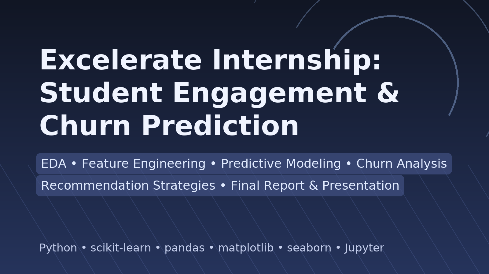

# 📊 Excelerate Internship: Student Engagement & Churn Prediction

Welcome to the final project repository for the Excelerate Virtual Internship Program. This repository showcases a complete data science pipeline developed to understand student engagement patterns, predict churn behavior, and propose actionable strategies to improve retention.

## 🚀 Project Overview

Over the span of 4 weeks, our team explored a rich dataset of student engagement with virtual learning opportunities. The project focused on:

- Exploratory Data Analysis (EDA)
- Feature Engineering
- Predictive Modeling
- Churn Analysis
- Recommendation Strategies
- Final Report and Presentation

## 🧠 Problem Statement

How can we use historical student engagement data to:

- Predict which students are at risk of dropping out (churn)?
- Understand what factors drive retention?
- Recommend strategies to improve engagement and reduce drop-off rates?

---

## 📅 Weekly Breakdown

### Week 1: Exploratory Data Analysis & Feature Engineering
- Cleaned and standardized raw data
- Handled missing values thoughtfully
- Created derived features (Age, Engagement Lag, Normalized scores, etc.)
- Identified trends in signup behavior, dropout patterns

### Week 2: Visual Analytics & Insights
- Generated key visualizations (Top categories, countries, age-groups)
- Derived insights on dropout reasons
- Analyzed student journey stages (sign-up → apply → dropout)

### Week 3: Predictive Modeling
- Defined churn labels using status codes
- Modeled churn using:
  - Logistic Regression
  - Decision Tree
  - Random Forest
  - (Optional: Naive Bayes, SVM)
- Evaluated models using Accuracy, F1-Score, ROC-AUC

### Week 4: Recommendations & Final Report
- Synthesized insights from modeling
- Proposed retention strategies
- Built a basic rule-based recommendation system
- Delivered final report and Loom-recorded presentation

---

## 📁 Repository Structure
📦 Excelerate_Internship_Project/
│
├── Final.ipynb # Full code notebook with cleaning, modeling & insights
├── Week1_Feature_Engineering_Report_Team_8.docx
├── Week 2 Report.docx
├── Week 3 Churn Analysis Report.docx
├── Week 4 Final Report.docx # Consolidated report with all insights
├── data/
│ └── Week1_Cleaned_dataset.csv
├── images/
│ └── [Visualizations & ROC Curves]
└── README.md # This file

---

## 📌 Key Tools & Technologies

- **Python**: Pandas, NumPy, Scikit-learn, Matplotlib, Seaborn
- **Jupyter Notebook**: End-to-end workflow
- **Power BI / Excel** (optional): Supplementary visuals
- **Loom**: Final project presentation
- **GitHub**: Version control and portfolio publishing

---

## ✅ Outcomes

- Identified top factors influencing student dropout
- Built models with up to **94%+ accuracy** in predicting churn
- Proposed targeted retention strategies
- Developed practical recommendations for program improvement

---

## 👩‍💻 Contributors

**Team 8 – Excelerate Internship**  
Lead Analyst: PHANIDHAR VENKATA NAGA KASUBA  
Team members:  Lily Nyambune, Christian Onyekwulunne, Divyesh Shinde, Amit Kumar, Vishal Reddy.

---

## 📬 Contact

For questions, feel free to connect via [LinkedIn](www.linkedin.com/in/phanidhar-kasuba-venkata-naga) or reach out at kasubavenkatanagaphanidhar@gmail.com

---

⭐️ If you found this project useful or inspiring, feel free to give this repo a star!
